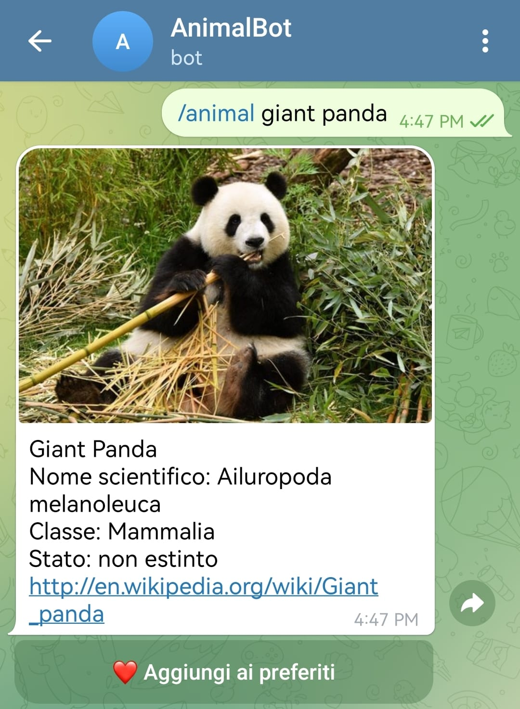
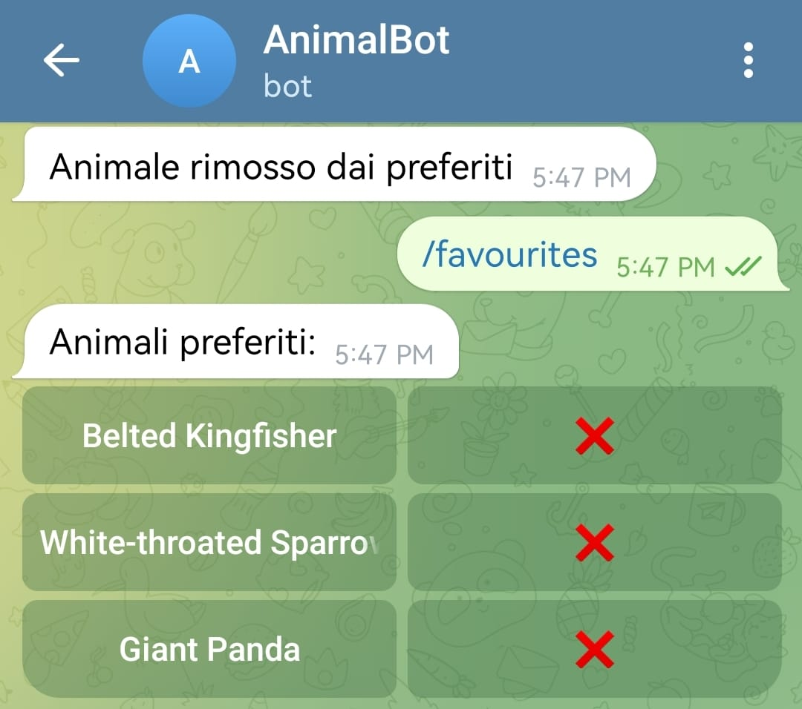

# AnimalBot 

AnimalBot è un **bot Telegram scritto in Java** che permette di cercare informazioni sugli animali utilizzando l’API di **iNaturalist**.  
Il bot consente di:
- cercare animali per nome
- ricevere un animale casuale
- salvare animali nei preferiti
- visualizzare la cronologia delle ricerche
- consultare statistiche sugli animali più cercati

Il progetto utilizza **SQLite** come database locale e la libreria ufficiale **TelegramBots Java**.

---

## Funzionalità principali

- Ricerca animali tramite nome
- Informazioni dettagliate (nome scientifico, classe, stato di estinzione)
- Immagine dell’animale (se disponibile)
- Sistema di preferiti con pulsanti inline
- Animale casuale
- Cronologia ricerche
- Statistiche sugli animali più cercati
- Gestione cronologia e preferiti

---

## API utilizzata

### iNaturalist API
Utilizzata per ottenere informazioni sugli animali.

- Base URL:  
  https://api.inaturalist.org/v1
- Documentazione ufficiale:  
  https://api.inaturalist.org/v1/docs/

**Nota:** l’API di iNaturalist **non richiede API key**.

---

## Tecnologie utilizzate

- Java 17+
- TelegramBots Java (Long Polling)
- SQLite
- Gson (JSON parsing)
- HttpClient (Java)

---

## Dipendenze Maven

```xml
<dependencies>
        <dependency>
            <groupId>com.google.code.gson</groupId>
            <artifactId>gson</artifactId>
            <version>2.13.1</version>
        </dependency>
        <dependency>
            <groupId>org.telegram</groupId>
            <artifactId>telegrambots-longpolling</artifactId>
            <version>9.2.0</version>
        </dependency>
        <dependency>
            <groupId>org.telegram</groupId>
            <artifactId>telegrambots-client</artifactId>
            <version>9.2.0</version>
        </dependency>
        <dependency>
            <groupId>org.apache.commons</groupId>
            <artifactId>commons-configuration2</artifactId>
            <version>2.12.0</version>
        </dependency>
        <dependency>
            <groupId>commons-beanutils</groupId>
            <artifactId>commons-beanutils</artifactId>
            <version>1.9.4</version>
        </dependency>
        <dependency>
            <groupId>org.xerial</groupId>
            <artifactId>sqlite-jdbc</artifactId>
            <version>3.46.0.1</version>
        </dependency>
    </dependencies>
```

## Setup del progetto
### Clonare la repository
```bash
git clone https://github.com/USERNAME/animalbot.git  
cd animalbot
```

### Creare il database SQLite

Crea il file:
database/animalbot.db

Tabelle SQL
```sql
CREATE TABLE users (
    telegram_id INTEGER PRIMARY KEY,
    username TEXT,
    first_name TEXT,
    created_at DATETIME DEFAULT CURRENT_TIMESTAMP
);

CREATE TABLE search_history (
    id INTEGER PRIMARY KEY AUTOINCREMENT,
    telegram_id INTEGER,
    animal_name TEXT,
    searched_at DATETIME DEFAULT CURRENT_TIMESTAMP
);

CREATE TABLE favourites (
    telegram_id INTEGER,
    animal_id INTEGER,
    animal_name TEXT,
    PRIMARY KEY (telegram_id, animal_id)
);
```

### File di configurazione (template)

Crea il file:
config.properties.example

BOT_TOKEN=INSERISCI_IL_TUO_BOT_TOKEN

**Nota:** config.properties va messo nel .gitignore

---

## Comandi disponibili
```text
/start - Avvia il bot  
/help - Mostra l’elenco dei comandi
/animal <nome> - Cerca un animale
/random	- Animale casuale
/history - Ultime ricerche
/clearhistory - Cancella cronologia
/favourites - Mostra preferiti
/stats - Animali più cercati
```

---

## Esempi di utilizzo
### Ricerca animale


### Preferiti


### Cronologia


---

## Schema del database  
users  
 └── telegram_id (PK)

search_history  
 └── telegram_id → users.telegram_id

favourites  
 └── (telegram_id, animal_id) (PK) → users.telegram_id

---

## Query di esempio implementate
### Animali più cercati
```sql
SELECT animal_name, COUNT(*) AS searches
FROM search_history
GROUP BY animal_name
ORDER BY searches DESC
LIMIT 10;
```

### Preferiti di un utente
```sql
SELECT animal_id, animal_name
FROM favourites
WHERE telegram_id = ?;
```
